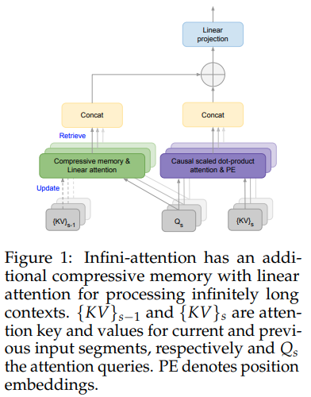

</img>

## Infini-Transformer - Pytorch

Implementation of <a href="https://arxiv.org/abs/2404.07143">Infini-Transformer</a> in Pytorch. They use a linear attention scheme to compress past memories and demonstrate multiple SOTAs for long context benchmarks.

Although unlikely to beat <a href="https://github.com/lucidrains/ring-attention-pytorch">Ring Attention</a>, I think it is worth exploring, as the techniques are orthogonal.

<a href="https://www.youtube.com/watch?v=r_UBBfTPcF0">Yannic Kilcher's explanation</a>

## Install

```bash
$ pip install infini-transformer-pytorch
```

## Usage

```python
import torch
from infini_transformer_pytorch import InfiniTransformer

transformer = InfiniTransformer(
    num_tokens = 256,
    dim = 512,
    depth = 8,
    dim_head = 128,  # high head dimension may be part of the reason they got good results (kv has high capacity)
    heads = 8,
    rotary_emb_linear_attn = True
)

x = torch.randint(0, 256, (1, 1024))

logits1, cached_kv1, mem1 = transformer(x, return_new_memories = False)
logits2, cached_kv2, mem2 = transformer(x, past_memories = mem1, cached_kv = cached_kv1, return_new_memories = False)
logits3, cached_kv3, mem3 = transformer(x, past_memories = mem2, cached_kv = cached_kv2, return_new_memories = True)

```

Training a transformer with recurrence usually trips up a lot of researchers, so to make it easy, just wrap it with `InfiniTransformerWrapper`

```python
import torch

from infini_transformer_pytorch import (
    InfiniTransformer,
    InfiniTransformerWrapper
)

# model and wrapper

model = InfiniTransformer(
    num_tokens = 256,
    dim = 512,
    depth = 8,
    dim_head = 128,  # high head dimension may be part of the reason they got good results (kv has high capacity)
    heads = 8,
    rotary_emb_linear_attn = True
)

wrapper = InfiniTransformerWrapper(
    model,
    segment_length = 512
)

# mock input

seq = torch.randint(0, 256, (2, 4096 + 1))

# training

loss = wrapper(seq)
loss.backward()

# after much data...
# generating is as easy as

output = wrapper.generate(seq_len = 8192, prompt = seq[:, :1])

output.shape # (2, 8192 - 1)
```

## Todo

- [ ] working example with enwik8

## Citations

```bibtex
@inproceedings{Munkhdalai2024LeaveNC,
    title   = {Leave No Context Behind: Efficient Infinite Context Transformers with Infini-attention},
    author  = {Tsendsuren Munkhdalai and Manaal Faruqui and Siddharth Gopal},
    year    = {2024},
    url     = {https://api.semanticscholar.org/CorpusID:269033427}
}
```
